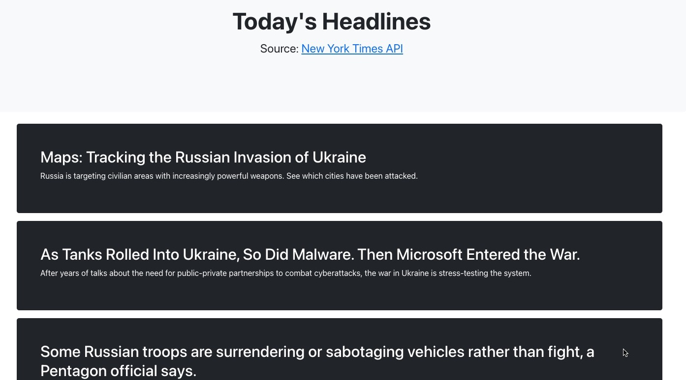

# React with API call 
This application makes an API call.

#### By Karen Axon & Kate Kiatsiri

<p align="center">
  
</p>


## Technologies Used

* React with Redux
* New York Times API
* Javascript / JSX
* HTML
* CSS


## Setup/Installation 

* Click on the [repository's](https://github.com/karenaxon/react-api.git) link.
* Click on the green "Code" button and copy the repository URL.
* Open your terminal and navigate to the location where you would like to clone the application.
* Use the command _git clone https://github.com/karenaxon/react-api.git_ to clone the repository.
* From the root directory of the application, the kegs-tracker, run the following commands:
  - _npm install_
  - _npm run start_
* Navigate to ```localhost:3000``` in your favorite web browser to view the project.


## Known Bugs
* None


## License

[MIT](https://choosealicense.com/licenses/mit/)

Copyright (c) February 2022 - Karen Axon, Kate Kiatsiri


## Contact Information:

<h3>Karen Axon</h3>

[](https://github.com/karenaxon)
[](https://www.linkedin.com/in/kaxon)

<h3>Kate Kiatsiri</h3>

[](https://github.com/keidsiri)
[](https://www.linkedin.com/in/kiatsiri)